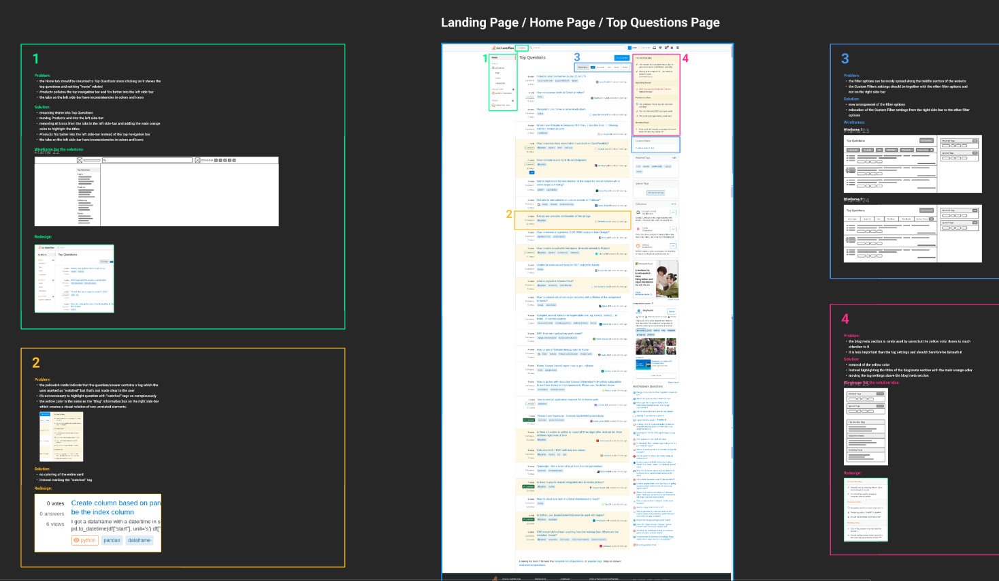

# Design Artefacts

## Websites:
### :earth_africa: name-to-ethnicity
##### Website Link: http://www.name-to-ethnicity.com
##### GitHub Link: https://github.com/name-ethnicity-classifier
##### Description:
A web application for classiying names by their ethnicity and requesting custom trained machine-learning models ([paper](https://link.springer.com/article/10.1007/s00146-022-01619-4)).
##### Preview:

---

### :bullettrain_front: Train Travel Companion:
##### GitHub Link: https://github.com/ID-Start-Winter22/travy-train-travel-companion
##### Description:
A web application for chatting with a chat bot that updates you on your *Deutsche Bahn* train journies. This was our final project of our first semester.
##### Preview:

---

### :oncoming_police_car: Polisim:
##### Link to repository: https://github.com/polisim-uni-project/polisim-website
##### Description:
A website for a (kinda fictional) Police Training Simulation company which we worked out as part of the second semester project. The VR head was designed by @cma5 and is embedded to the website via ThreeJS (and follows the mouse cursor!).
##### Preview:

---

### :tram: Pay-Per-Ride simulation:
##### Link to repository: https://github.com/theopfr/pay-per-ride-simulation
##### Description:
A website displaying an interactive pay-per-ride / check-in/out subway ticket system, created as part of my second semester.
##### Preview:

---

# Illustrations:
### :bar_chart: Dashboard illustration:
##### Preview:

##### SVG for download: [here](./illustrations/dashboard.svg)

---

### 🏗️ Industrial IoT illustration:
##### Preview:

##### SVG for download: [here](./illustrations/industrial_iot.svg)

---

# UI Prototypes:
### ❓ StackOverlow Audit:
##### Figma Link: [here](https://www.figma.com/file/PIF4Xk8BxY7dbY5dUTPXD0/Untitled?type=design&node-id=0%3A1&t=SQCKj0jOfmwEtRgM-1)
##### Description:
An UI/UX audit which I had to do as part of my first semester.
##### Peview:

---

### 👨‍💻 LangLearn Prototype:
##### Figma Link: [here](https://www.figma.com/proto/VLhUg85cXP59myWUoaZjyu/learn-app-prototype?node-id=1-187&starting-point-node-id=1%3A187&scaling=contain)
##### Description:
A click dummy prototype for an app to learn programming.
##### Peview:

---

# Presentations:
### 1. System Mapping:
##### PDF: [here](./presentations/system_mapping.pdf)
##### Preview:

---

### 2. Industrial UX:
##### Google Slides Link: [here](https://docs.google.com/presentation/d/1BdW8Rz-WX955gyxZwtxURWRWeYYuoTHpBbSx82V4YQ4/edit?usp=sharing)
##### Preview:

---

### 2. Train Travel Companion - Sprint 2:
##### Link: [here](https://docs.google.com/presentation/d/1qgQ9b2sS4t0_ub_36XoJvbZLuYn609EOWrI0jRwRrYo/edit?usp=sharing)
##### Preview:
